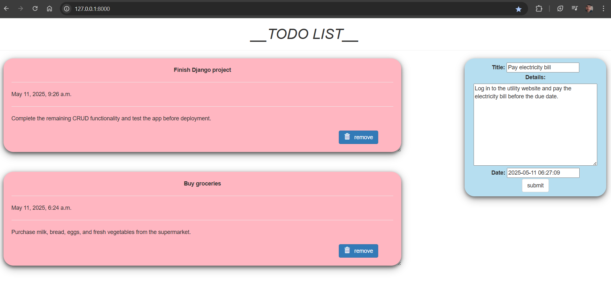

# 📝 TODO List App - Django

 <!-- REPLACE THIS WITH YOUR SCREENSHOT -->

A beautiful and functional Todo List application built with Django and Bootstrap.

## ✨ Features
✔️ Add tasks with title, details, and date  
✔️ Delete tasks with one click  
✔️ Responsive design (mobile-friendly)  
✔️ Attractive card-based UI with hover effects  
✔️ User notification system  

## 🛠️ Tech Stack
- **Backend**: Django 5.2.1
- **Frontend**: Bootstrap 3 +
- **Database**: SQLite (default)
- **Styling**: Custom CSS animations

## 🚀 Quick Start

### Prerequisites
- Python 3.8+
- pip

### Installation
```bash
# Clone the repository
git clone https://github.com/Shaquibkhandbg/django-todo-app.git
cd django-todo-app

# Install dependencies
pip install -r requirements.txt

# Run migrations
python manage.py migrate

# Start development server
python manage.py runserver